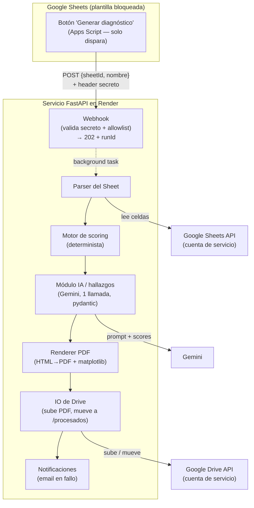

# ARCHITECTURE — Generador de diagnósticos de Ventas & MKT Digital

Describe **cómo** está estructurado el sistema y **por qué**. El contexto, las
decisiones de stack y el dominio están en [`docs/BRIEF.md`](./BRIEF.md) y
[`CLAUDE.md`](../CLAUDE.md); no se re-litigan aquí. La secuencia de build vive en
`docs/PLAN.md` (fuera de este documento).

Tamaño real del sistema: un servicio, pipeline lineal, **una** llamada al LLM,
single-tenant, bajo volumen, sin base de datos. El rigor de este documento está
dimensionado a eso.

---

## 1. Visión general

Un consultor llena una plantilla bloqueada en Google Sheets durante una llamada con
su cliente y presiona "Generar diagnóstico". Apps Script dispara un webhook; el
servicio Python lee el Sheet, recalcula el scoring de forma determinista, pide a
Gemini la prosa de los hallazgos (validada por pydantic), arma un PDF de dos páginas
(hallazgos + radar de 7 ejes) y lo sube a Drive. El consultor recibe el PDF en la
carpeta de resultados y una alerta por email si algo falla.

El trigger es **fire-and-ack**: Apps Script recibe `202` de inmediato y todo el
trabajo pesado ocurre en background.



La frontera asíncrona está en el webhook: lo que ocurre **antes** del `202` es solo
validación; el pipeline `parser → scoring → IA → render → upload → notificación`
ocurre **después**, en background (ver §4).

---

## 2. Componentes y responsabilidades

**Principio rector: toda la lógica vive en Python; el trigger solo dispara.** Apps
Script no parsea, no puntúa, no decide nada. Esto mantiene una sola fuente de verdad
testeable y evita lógica de negocio dispersa en un entorno (Apps Script) difícil de
probar y versionar.

| Componente | Responsabilidad | No hace |
|---|---|---|
| **Apps Script** (en el Sheet) | Botón → `POST` fire-and-ack con `sheetId` + `nombre` + secreto en header; muestra toast. | Parsear, puntuar, esperar el resultado. |
| **Webhook** (FastAPI) | Validar secreto, validar `sheetId` (allowlist), rate-limit; encolar el trabajo en background; responder `202` + `runId`. | Trabajo pesado en el request. |
| **Parser del Sheet** | Leer celdas fijas según el mapa de celdas versionado; producir el modelo normalizado de las 52 respuestas crudas (v2) + observaciones; chequear completitud y versión de plantilla. | Calcular scores; confiar en fórmulas cacheadas. |
| **Motor de scoring** | Recalcular desde `CALIFICA` crudas: medias por factor, PUNTAJE, %, banda, valores del radar. Determinista y puro. | Llamar a la IA o a la red. |
| **Módulo IA / hallazgos** | Pre-seleccionar factores, construir el prompt, **una** llamada a Gemini, validar salida con pydantic, aplicar reglas de negocio, enriquecer con severidad. | Calcular o alterar números, %, bandas o radar. |
| **Renderer PDF** | Tomar el modelo del reporte (scores + hallazgos validados) y producir el PDF de dos páginas (HTML→PDF + radar PNG de matplotlib). | Tomar decisiones de scoring o de selección de hallazgos. |
| **IO de Drive** | Subir el PDF a la carpeta de resultados; mover el Sheet/registro a `/procesados`. | Mantener estado fuera de Drive. |
| **Notificaciones** | Emitir el evento de corrida al log; enviar email de alerta en fallo. | — |

---

## 3. Contratos / interfaces

Esta es la parte más valiosa del documento. Los esquemas se muestran como modelos
pydantic / firmas, no como implementación.

### 3.1 Webhook

Único endpoint expuesto a internet. Fire-and-ack: valida y responde rápido.

```
POST /v1/diagnosticos
Headers:
  X-Stragia-Secret: <secreto compartido>      # validado contra env var
  Content-Type: application/json
Body:
  { "sheetId": "<id del Google Sheet>", "nombre": "<nombre de la empresa/cliente>" }
```

```python
class WebhookPayload(BaseModel):
    sheetId: str
    nombre: str

class WebhookAck(BaseModel):
    status: Literal["accepted"] = "accepted"
    runId: str          # id de correlación para rastrear la corrida en logs
```

Respuestas:

| Código | Significado | Cuándo |
|---|---|---|
| `202 Accepted` | Aceptado, trabajo encolado. Devuelve `runId`. | Secreto válido, `sheetId` permitido, payload bien formado. |
| `400 Bad Request` | Payload inválido. | Falta `sheetId`/`nombre` o no parsea. |
| `401 Unauthorized` | Secreto ausente o incorrecto. | Header inválido. |
| `403 Forbidden` | `sheetId` no autorizado. | El Sheet no está en la carpeta de entrada permitida (§5). |
| `429 Too Many Requests` | Rate-limit excedido. | Más requests que el límite básico del endpoint. |

El `202` **no** garantiza que el diagnóstico se genere: solo que fue aceptado. El
éxito/fallo del trabajo se observa por log + email (§9), no por la respuesta HTTP.

### 3.2 Modelo de datos normalizado (parser → scoring)

Salida del parser — las 52 respuestas crudas (v2) agrupadas por factor, más las
observaciones que la IA usará como grounding:

```python
class RespuestaCruda(BaseModel):
    factor_id: int                 # 1..7
    pregunta_idx: int              # índice de la pregunta dentro del factor
    califica: int                  # 0..4 (CALIFICA; única fuente de score)
    # SI/NO es informativo y NO se modela para el cálculo (puede ser N/A).

class FactorCrudo(BaseModel):
    factor_id: int                 # 1..7
    nombre: str
    respuestas: list[RespuestaCruda]
    observaciones: str             # texto libre del consultor para ese factor

class SheetNormalizado(BaseModel):
    template_version: str
    empresa: str
    factores: list[FactorCrudo]    # exactamente los 7 factores de ventas
```

Salida del scoring (entrada al render y al módulo IA):

```python
Banda = Literal["BAJO", "MEDIO", "ALTO"]

class FactorScore(BaseModel):
    factor_id: int
    nombre: str
    media: float                   # media aritmética de CALIFICA (escala 0..4)
    observaciones: str

class ResultadoScoring(BaseModel):
    factores: list[FactorScore]    # 7 medias → ejes del radar
    puntaje: float                 # media de las 7 medias (0..4)
    porcentaje: float              # puntaje / 4 * 100
    banda: Banda                   # derivada del porcentaje
```

### 3.3 IA (Gemini)

**Qué se le manda.** No se le pide elegir factores ni cifras. Python pre-selecciona
los **factores débiles** (banda baja/media) y le pasa, por cada uno, su nombre,
media, banda y `observaciones`; la IA solo redacta prosa aterrizada en eso (ver
§3.3.1). Entrada conceptual:

```python
class FactorParaIA(BaseModel):
    factor_id: int
    nombre: str
    media: float
    banda: Banda
    observaciones: str

class EntradaIA(BaseModel):
    empresa: str
    porcentaje_global: float
    banda_global: Banda
    factores_debilidad: list[FactorParaIA]   # preseleccionados: banda baja/media
```

**Esquema de salida (lo que el BRIEF dejó pendiente — aquí se fija).** El
diagnóstico resalta **solo debilidades**: las fortalezas se evalúan (aparecen en el
radar) pero **no se redactan**. La IA emite **solo prosa**, en una única lista de
debilidades. No emite severidad, números ni factores nuevos:

```python
class HallazgoIA(BaseModel):
    factor_id: int                 # debe ser uno de los preseleccionados
    texto: str                     # 1–2 oraciones, sin cifras inventadas

class SalidaIA(BaseModel):
    debilidades: list[HallazgoIA]  # TODOS los factores de banda baja/media (una c/u)
```

Decisiones del esquema:

- **Solo debilidades:** el diagnóstico se enfoca en resaltar debilidades; los
  factores altos se siguen evaluando (radar de 7 ejes y scoring sin cambios) pero no
  generan hallazgo textual ni sección de fortalezas.
- **Cantidad:** **todas** las debilidades encontradas — una por cada factor de banda
  baja/media (sin tope). La validación exige **cobertura completa** del conjunto
  preseleccionado (ni de más ni de menos).
- **Sin "debilidad" en factor alto, por construcción:** como `deb_ids` solo contiene
  factores de banda baja/media, una debilidad sobre un factor alto es imposible (no
  es un chequeo frágil, es un invariante del flujo).
- **Severidad:** **no la emite la IA.** Se deriva determinísticamente de la banda
  del factor y se inyecta después (ver enriquecido abajo).
- **Orden:** las debilidades se ordenan por media ascendente (factor más bajo →
  severidad más alta primero).

**Enriquecido (lo que recibe el renderer).** Tras validar la `SalidaIA`, Python
inyecta los metadatos numéricos y la severidad — la IA nunca los tocó:

```python
Severidad = Literal["alta", "media", "baja"]

class HallazgoRenderable(BaseModel):
    factor_id: int
    factor_nombre: str
    media: float
    severidad: Severidad           # derivada de la banda del factor (§7)
    texto: str                     # prosa validada de la IA
```

Si la validación pydantic o las reglas de negocio fallan: **un** reintento, luego
fallback seguro (§9). Nunca se renderiza salida de IA sin validar.

#### 3.3.1 Prompt (forma)

El prompt se parte en **capa-persona** (criterio/tono del consultor; lo entrega el
cliente) + **capa-grounding/guardrails** (nuestra: esquema JSON estricto,
temperatura baja, "no inventes cifras ni causas fuera de `observaciones`", aterrizar
cada hallazgo en su factor). Hoy se construye con un prompt base hasta recibir la
capa-persona. *(TBD del BRIEF — ver §12.)*

### 3.4 Render

El renderer es puro: recibe un modelo ya calculado y validado y produce bytes de PDF.
No decide nada.

```python
class ReportePDF(BaseModel):
    empresa: str
    fecha: str                     # estampada por el caller
    puntaje: float
    porcentaje: float
    banda: Banda
    mensaje_banda: str             # frase fija por banda (determinista; no la IA)
    radar: list[FactorScore]       # los 7 factores (radar + desglose de pág. 1)
    debilidades: list[HallazgoRenderable]   # solo factores débiles, con texto (pág. 2)

def render_pdf(reporte: ReportePDF) -> bytes: ...
```

**Diseño de salida (Stragia, 2 páginas):**
- **Pág. 1:** header (logo + empresa/fecha), resultado global (anillo %, puntaje/4,
  pill de banda, `mensaje_banda`), radar de 7 ejes, y desglose de los **7** factores.
- **Pág. 2:** "Hacia dónde dirigir tu energía" — plan de acción: una tarjeta por
  **factor débil** (ordenados por prioridad) con su hallazgo de IA. Los factores
  altos aparecen en el radar/desglose de pág. 1, no en pág. 2.

El radar se genera como PNG con matplotlib y se embebe en el HTML que WeasyPrint
convierte a PDF (§11). El HTML separa "construir HTML" (puro, testeable) de "HTML→PDF".

---

## 4. Flujo de datos

La línea divisoria es el `202`. Antes de él: solo validación barata. Después: el
pipeline completo en background.

**Antes del `202` (síncrono, en el request):**

1. Llega `POST` con `sheetId`, `nombre`, secreto en header.
2. Validar secreto → `401` si falla.
3. Rate-limit → `429` si excede.
4. Validar payload → `400` si malformado.
5. Validar que `sheetId` esté en la carpeta de entrada autorizada → `403` si no (§5).
6. Generar `runId`, emitir evento `started`, encolar el pipeline como background
   task, responder `202 {status, runId}`.

**Después del `202` (asíncrono, en background):**

7. **Parser:** cuenta de servicio lee el Sheet → `SheetNormalizado` (chequeo de
   versión y completitud; §6).
8. **Scoring:** recálculo determinista desde `CALIFICA` crudas → `ResultadoScoring`
   (§7).
9. **IA:** pre-selección de factores → una llamada a Gemini → validación pydantic +
   reglas de negocio → `HallazgoRenderable[]` (un reintento, luego fallback).
10. **Render:** `ReportePDF` → bytes del PDF de dos páginas.
11. **Upload:** subir el PDF a la carpeta de resultados en Drive.
12. **Idempotencia:** mover el Sheet/registro procesado a `/procesados`.
13. **Notificación:** emitir evento `success` (o `failed` + email en cualquier
    fallo de los pasos 7–12).

---

## 5. Modelo de acceso y seguridad

- **Cuenta de servicio, cuenta personal (no Workspace):** no hay shared drives. Las
  carpetas de **entrada** y **resultados** se comparten manualmente con el **email
  de la cuenta de servicio**. El acceso del servicio se limita a lo que esas
  carpetas le dan.
- **Secretos por variables de entorno en Render.** Nunca se commitean llaves ni el
  secreto compartido ni las credenciales de la cuenta de servicio.
- **Validación del secreto compartido:** el webhook valida el header `X-Stragia-Secret`
  contra una env var antes de cualquier otra cosa. El endpoint está expuesto a
  internet.
- **Allowlist de `sheetId` (defensa en profundidad):** un secreto filtrado **no**
  debe poder procesar Sheets arbitrarios. Tras validar el secreto, el servicio
  consulta Drive (`files.get(sheetId, fields="parents")`) y exige que el Sheet esté
  dentro de la **carpeta de entrada autorizada** (`INPUT_FOLDER_ID`); si no, `403`.
  Esto evita exfiltración o procesamiento de Sheets ajenos aunque el secreto se
  filtre. *(El umbral exacto y un posible respaldo por env var de IDs son supuestos;
  §12.)*
- **Scopes de mínimo privilegio para la cuenta de servicio:**
  - `https://www.googleapis.com/auth/spreadsheets.readonly` — leer el Sheet.
  - `https://www.googleapis.com/auth/drive.file` u operación restringida a las
    carpetas compartidas — subir el PDF y mover lo procesado. No se pide acceso
    total a Drive.
- **Rate-limit básico** en el endpoint (límite global bajo, p. ej. unas pocas
  requests por minuto). Como es single-tenant y un solo consultor, basta un límite
  conservador para amortiguar abuso/doble clic. *(Mecanismo y umbral exactos:
  supuesto; §12.)*

---

## 6. Contrato de la plantilla del Sheet

El mapa de celdas es el **contrato del parser** y está TBD (se produce como paso 1
del build, no se inventa aquí). Lo que sí se fija es la **forma** del contrato:

- **Mapa de celdas versionado como única fuente de verdad.** Un artefacto (p. ej.
  un módulo/archivo de constantes) que mapea cada `CALIFICA` y cada `OBSERVACIONES`
  de los 7 bloques a su celda. El parser **solo** lee de este mapa; ninguna
  coordenada vive dispersa en el código.
- **Named ranges** en el Sheet en vez de coordenadas A1 crudas donde sea posible,
  para que mover filas no rompa el parser.
- **Celda `template_version`** en la plantilla. El parser la lee primero; si no
  coincide con una versión soportada del mapa → error de versión desconocida (no se
  procesa con un mapa equivocado).
- **Chequeo de completitud:** verificar que todas las celdas esperadas existen y
  tienen valor antes de puntuar. Un Sheet incompleto es un fallo de validación, no
  un score parcial silencioso.

Las coordenadas exactas, los named ranges y la convención de bloques se derivan del
archivo de ejemplo real (VASE) al construir el mapa. *(TBD; §12.)*

---

## 7. Algoritmo de scoring

Determinista, puro, sin red, recalculado **siempre desde las celdas `CALIFICA`
crudas** (las fórmulas cacheadas del Sheet pueden estar viejas y la API no
recalcula).

1. **Califica por pregunta:** entero `0..4` (Mal=0, Regular=1, Bien=2, Muy Bien=3,
   Excelente=4). `SI/NO` es informativo y **nunca** entra al cálculo.
2. **Media por factor:** media aritmética de las `CALIFICA` de las preguntas de ese
   factor → `media_f` (escala 0..4). Son los 7 ejes del radar (máximo 4).
3. **PUNTAJE global:** media de las 7 medias de factor (método "promedio de
   promedios" de la hoja Evaluación). **No** es suma-total/ideal.
4. **% de cumplimiento:** `PUNTAJE / 4 × 100`.
5. **Banda global** (desde el %, nunca por la IA): `< 60 % → BAJO`,
   `60–79 % → MEDIO`, `≥ 80 % → ALTO`.

**Severidad por factor** (para los hallazgos, §3.3): se reutilizan los mismos
umbrales aplicados al factor como `media_f / 4 × 100` → BAJO/MEDIO/ALTO, y se mapea
BAJO→`alta`, MEDIO→`media`. Los factores ALTO no generan hallazgo (se evalúan en el
radar pero no se redactan). Es lo que selecciona qué factores van a `debilidades`.
*(El mapeo severidad↔banda es un supuesto; §12.)*

Caso base conocido (VASE, estructura histórica de 49): `PUNTAJE 2.37 / 4 = 59.3 % →
BAJO`. Se conserva como **golden de matemática** del motor (la fórmula no cambió con
v2). El segundo cálculo suma-total/ideal del archivo (116/196 = 59.18 %) **no se usa**.

---

## 8. Estrategia de verificación

El riesgo central del proyecto es producir **scores silenciosamente incorrectos** o
**alucinaciones de la IA**. Por eso la verificación es de primer nivel. Se describe
**qué** se prueba y **cómo** se aísla, no los tests en sí.

**8.1 Golden-file del scoring (núcleo).** Un fixture conocido → scores, %, y banda
conocidos. **Caso base: VASE** (`PUNTAJE 2.37`, `59.3 %`, `BAJO`, y sus 7 medias) —
se mantiene como golden de matemática (estructura histórica de 49) porque la fórmula
es la misma en v2. La estructura v2 (52 preguntas) se cubre con un fixture sintético
derivado del `cell_map`. Se aísla del Sheets API: el fixture es la matriz de
`CALIFICA` crudas en local, de modo que el test ejercita el motor de scoring puro
sin red. Cualquier desviación en una media, en el PUNTAJE, en el % o en la banda
falla el test.

**8.2 Validación de la salida de la IA.** Toda salida de Gemini se valida contra
`SalidaIA` (pydantic) antes de usarse. Encima del esquema se chequean reglas de
negocio:

- Cada `factor_id` de un hallazgo pertenece al conjunto **preseleccionado** (la IA
  no puede introducir un factor).
- **Ningún hallazgo de "debilidad" sobre un factor de banda alta** (garantizado
  porque `deb_ids` solo trae factores bajos/medios + chequeo defensivo).
- **Cobertura completa:** la salida cubre exactamente los factores débiles
  preseleccionados (todas las debilidades; sin duplicados). El diagnóstico no incluye
  fortalezas.

Se aísla con la llamada a Gemini *mockeada*: tests que alimentan salidas válidas,
malformadas y que violan reglas, y verifican que el flujo reintenta una vez y luego
cae al fallback seguro sin renderizar nunca salida inválida.

**8.3 Tests de contrato del parser (contra el mapa de celdas).** Se verifica el
comportamiento ante:

- **Celda faltante / vacía** → fallo de completitud, no score parcial.
- **`template_version` desconocida** → error de versión, no se procesa.
- **Sheet incompleto** → fallo de validación explícito.

Se aísla con fixtures de Sheet (o respuestas mock del Sheets API) que representan
cada caso degenerado; el parser nunca toca la red real en estos tests.

---

## 9. Operación: errores, idempotencia y observabilidad

**Manejo de errores.** Si la validación de la IA falla: **un** reintento de la
llamada a Gemini; si vuelve a fallar, **fallback seguro** — no se renderiza salida
inválida; la corrida se marca `failed` y se notifica. Los errores de parser/scoring
(versión, completitud) abortan la corrida con `failed` antes de gastar la llamada a
la IA.

**Idempotencia.** Al terminar con éxito, el Sheet/registro procesado se mueve a la
carpeta `/procesados` en Drive. Esto, más que el consultor no lance dos diagnósticos
a la vez (bajo volumen, single-tenant), evita reprocesos. No hay base de datos ni
estado externo.

**Concurrencia.** N/A — el consultor llena el Sheet en vivo con su cliente; no hay
dos diagnósticos simultáneos. No se necesitan colas ni locks.

**Observabilidad (crítica: el job es fire-and-forget; tras el `202` el consultor se
va a ciegas).**

- **Registro por corrida = log estructurado en Render (stdout).** Cada corrida emite
  eventos con su `runId`: `started`, y luego `success` (con la URL del PDF) o
  `failed` (con el error y el paso que falló). El log estructurado **es** el registro
  por corrida — no hay Sheet de log ni DB.
- **Dónde viven los logs:** el log stream de Render.
- **Alerta de error:** email al consultor en cualquier `failed`.
- **Detección de fallo silencioso (más allá del email):** un `runId` con `started`
  pero sin `success` ni `failed` indica que el background task murió sin notificar
  (p. ej. crash del proceso). La correlación por `runId` en el log permite detectarlo;
  el email cubre los fallos manejados, el par started/terminal cubre los no
  manejados.

---

## 10. Punto de extensión: gate de aprobación humana

Hoy el flujo corre full-auto. El **seam** para insertar aprobación humana está entre
el paso 9 (hallazgos validados) y el paso 10 (render/upload) del flujo (§4):

```
... → IA validada (HallazgoRenderable[]) → [GATE] → render → upload → notificación
```

Diseño para que se inserte sin rehacer el flujo:

- El paso post-IA produce un artefacto autocontenido (`ReportePDF` + hallazgos
  validados) que es la entrada del render. Ese artefacto es exactamente lo que un
  revisor humano aprobaría.
- Un flag de configuración (`APPROVAL_GATE`) decide si tras la validación se
  continúa al render (auto) o se pausa: se persiste el artefacto (p. ej. borrador en
  Drive) y se notifica para revisión; la aprobación re-dispara el render/upload con
  el mismo artefacto.
- Como el render y el upload ya son puros respecto del artefacto, activar el gate
  **no toca** el parser, el scoring ni la IA.

---

## 11. Decisiones técnicas (ADR breve)

Solo decisiones de **diseño** no cerradas ya en el BRIEF. El stack (FastAPI/Render,
Gemini+pydantic, Apps Script, HTML→PDF+matplotlib, sin DB) está fijado allí y no se
repite.

**ADR-1 — HTML→PDF: WeasyPrint (por defecto).**
- *Decisión:* WeasyPrint para convertir el layout HTML a PDF.
- *Razón:* el entregable es un layout estático de dos páginas; WeasyPrint es
  pure-Python, sin navegador headless que instalar y operar en Render. Menos
  superficie operativa.
- *Alternativa:* Chromium headless, si el diseño final exige CSS/JS avanzado que
  WeasyPrint no soporte. El renderer aísla esta dependencia para poder cambiarla.

**ADR-2 — Modelo async del background: `FastAPI BackgroundTasks` en proceso.**
- *Decisión:* el webhook responde `202` y ejecuta el pipeline con
  `BackgroundTasks` en el mismo proceso.
- *Razón:* bajo volumen, single-tenant, sin concurrencia (el consultor no lanza dos
  a la vez). No hay nada que una cola resuelva aquí.
- *Alternativa:* worker externo / cola (Redis, etc.) — rechazado en el BRIEF como
  sobre-ingeniería para este flujo stateless.

**ADR-3 — Allowlist de `sheetId`: verificación de carpeta padre en Drive.**
- *Decisión:* exigir que el `sheetId` esté dentro de `INPUT_FOLDER_ID` consultando
  `files.get(...parents)`.
- *Razón:* un secreto filtrado no debe procesar Sheets arbitrarios; ata el acceso a
  una carpeta que el operador controla, y permite agregar Sheets sin redeploy.
- *Alternativa:* env var con lista explícita de IDs — cero llamadas extra, pero
  requiere redeploy para cada Sheet nuevo; queda como posible respaldo.

**ADR-4 — Registro de corrida: log estructurado, sin tabla consultable.**
- *Decisión:* un evento de log estructurado por corrida (started/success/failed) +
  email en fallo; sin Sheet de log ni DB.
- *Razón:* a este volumen, el log stream de Render más el email cubren la operación;
  una tabla consultable es estado que el flujo stateless no justifica todavía.
- *Alternativa:* append a un Sheet de log para un histórico consultable — se puede
  añadir después sin tocar el pipeline si surge la necesidad.

**ADR-5 — Dónde vive cada cálculo: 100% en Python determinista.**
- *Decisión:* scoring, %, bandas, severidad y selección de factores ocurren en
  Python; la IA solo redacta prosa.
- *Razón:* invariante de dominio — un error de scoring produce diagnósticos
  incorrectos en silencio; la IA fuera de todo número elimina la clase entera de
  alucinaciones numéricas.
- *Alternativa:* ninguna aceptable; está fijado por los invariantes de CLAUDE.md.

---

## 12. Supuestos y preguntas abiertas

Todo supuesto está etiquetado; ningún TBD se resolvió inventando en silencio.

- **[DECIDIDO] Cantidad de hallazgos:** **todas** las debilidades (una por cada
  factor de banda baja/media; sin tope), con cobertura completa exigida. El
  diagnóstico resalta solo debilidades (las fortalezas se evalúan en el radar pero no
  se redactan). El criterio/tono final los entrega el cliente. *(TBD BRIEF §9.)*
- **[SUPUESTO] Mapeo severidad↔banda de factor:** reutiliza los umbrales globales
  (BAJO/MEDIO/ALTO) aplicados a `media_f / 4`. A confirmar con el criterio del
  consultor.
- **[TBD] Mapa de celdas exacto de la plantilla:** coordenadas, named ranges y
  bloques se derivan del archivo de VASE como paso 1 del build. Aquí solo se define
  la forma del contrato (§6); no se inventaron coordenadas.
- **[TBD] Diseño del PDF:** lo entrega el equipo de diseño. El renderer se construye
  con un layout placeholder y se enchufa el diseño final cuando llegue.
- **[TBD] Prompt del analista (capa-persona):** lo entrega el cliente. Se construye
  con un prompt base + nuestra capa de grounding/guardrails (§3.3.1).
- **[SUPUESTO] Allowlist:** carpeta padre en Drive como mecanismo primario; un
  respaldo por env var de IDs queda abierto.
- **[SUPUESTO] Rate-limit:** límite global bajo en el endpoint; mecanismo y umbral
  exactos por definir.
- **[PREGUNTA ABIERTA] Detalle de notificación de éxito:** hoy se notifica por email
  solo en fallo y el PDF aparece en la carpeta de resultados. Queda abierto si el
  consultor quiere también una confirmación de éxito (email/toast diferido).
